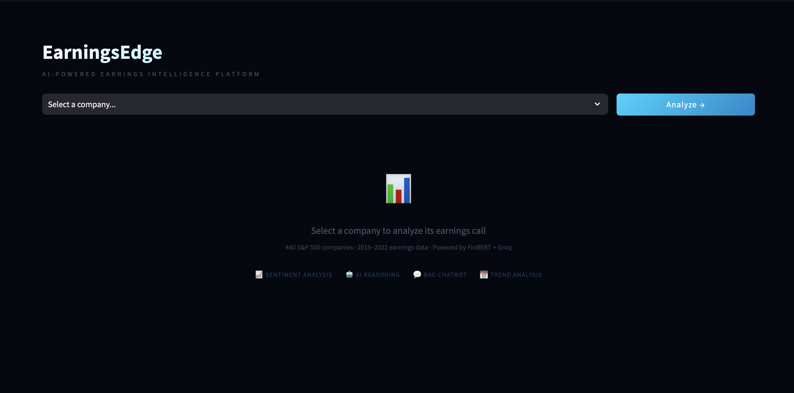
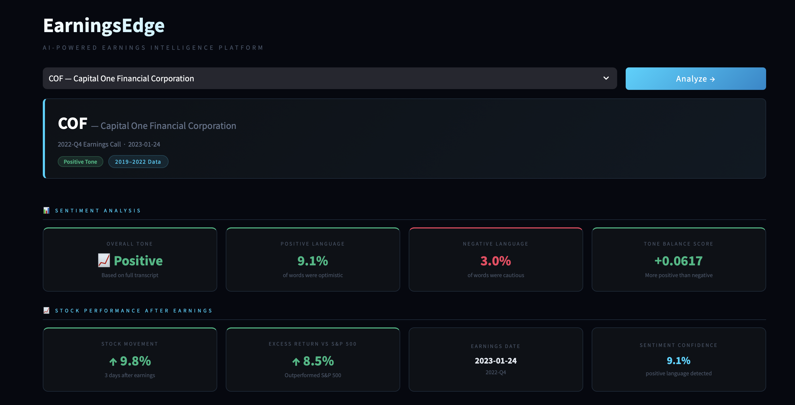
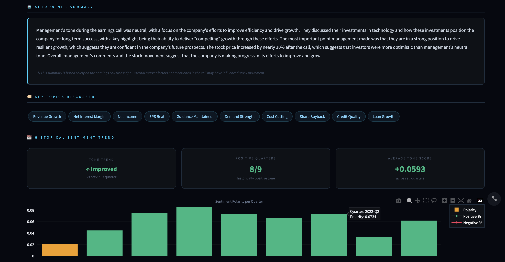

# EarningsEdge — AI-Powered Earnings Intelligence Platform

> Analyze what S&P 500 executives say on earnings calls and understand what it means for the stock.

[](https://huggingface.co/spaces/rjoshi-07/AI-powerd-Earnings-System)
[](https://python.org)
[](https://huggingface.co/ProsusAI/finbert)
[](https://streamlit.io)
[](https://docker.com)

---

## What is EarningsEdge

EarningsEdge is a production grade AI system that processes earnings call transcripts from 440 S&P 500 companies and extracts actionable financial intelligence. It answers the question that every investor, analyst, and portfolio manager asks after an earnings call: what did management actually say, how confident did they sound, and how did the market respond?

The system combines transformer based NLP, vector similarity search, and large language model reasoning into a single unified dashboard that any user, financial or non financial, can interact with in plain English.

---

## Live Demo

**[huggingface.co/spaces/rjoshi-07/AI-powerd-Earnings-System](https://huggingface.co/spaces/rjoshi-07/AI-powerd-Earnings-System)**







---

## The Problem This Solves

Earnings calls are the single most information dense event in a public company's quarter. CEOs and CFOs spend 60 to 90 minutes discussing revenue, margins, guidance, risks, and strategy. The tone of the call often moves the stock more than the actual numbers.

But almost nobody reads the full transcript. They are too long, too technical, and there are too many of them. S&P 500 companies report every quarter, generating 2,000 plus transcripts per year.

EarningsEdge makes that intelligence instantly accessible:

- A retail investor can understand what happened on an earnings call in 30 seconds
- An analyst can compare management tone across 8 quarters in one view
- Anyone can ask natural language questions and get answers directly from the transcript

---

## System Architecture
```
Raw Earnings Transcripts (Kaggle: 18,755 transcripts, 2,876 companies)
                    ↓
        Module 1: Data Collection
        Filter to S&P 500, pair with stock prices via yfinance
        Generate excess return labels vs S&P 500 benchmark
                    ↓
        Module 2: Text Cleaning Pipeline
        Remove speaker labels, boilerplate, stopwords
        Tokenization and lemmatization via spaCy
                    ↓
        Module 3: FinBERT Sentiment Analysis
        Chunk transcripts into 400 word segments
        Run ProsusAI/finbert on each chunk
        Average scores across all chunks per transcript
                    ↓
        Module 4: Feature Engineering
        11 dimensional feature vector per earnings call
        Sentence level FinBERT scoring for optimism and caution ratio
        Price volatility and previous quarter momentum signals
                    ↓
        Module 5: ML Research (XGBoost)
        Trained classifier on 3,013 labeled records
        Target: did stock outperform S&P 500 after earnings?
        Key finding: sentiment alone has limited predictive power
        This insight informed the pivot to an intelligence system
                    ↓
        Module 6: RAG Pipeline
        Transcript chunking → sentence transformers embeddings
        FAISS vector index for semantic search
        Groq LLM Llama 3.3 70B for grounded answer generation
                    ↓
        Module 7: Streamlit Dashboard
        Live analysis for any of 440 S&P 500 companies
        Deployed on Hugging Face Spaces via Docker
```

---

## Features

### Sentiment Analysis
FinBERT, a BERT model fine tuned on financial text, analyzes the full earnings call transcript and produces four metrics: positive language percentage, negative language percentage, tone balance score, and overall tone classification. Unlike generic sentiment models, FinBERT understands that "headwinds" is negative and "robust demand" is positive in financial context.

### Stock Performance After Earnings
Displays the actual stock movement 3 days after the earnings call and the excess return versus the S&P 500 benchmark. Excess return answers the real question: did the stock beat the market or just move with it?

### AI Earnings Summary
Groq's Llama 3.3 70B model receives the FinBERT scores, the stock movement data, and the most relevant transcript passages retrieved via FAISS semantic search. It generates a 4 to 5 sentence plain English summary explaining what management said, what the key takeaway was, and whether the market reaction aligned with the tone of the call. The LLM is strictly grounded and can only reference information from the transcript excerpts provided, preventing hallucination.

### Key Topics Discussed
The LLM identifies the most relevant themes from a predefined taxonomy of 40 financial categories including Revenue Growth, AI Investment, Guidance Raised, Interest Rate Impact, Credit Quality, and more. A fixed taxonomy ensures consistent and comparable theme labels across all companies and quarters.

### Historical Sentiment Trend
For companies with 3 or more quarters in the dataset the dashboard shows how management tone has evolved over time. The dual chart displays polarity per quarter and the positive versus negative language percentage trend, making it easy to spot whether a company's communication style is improving or deteriorating.

### RAG Chatbot
Users can ask any natural language question about the earnings call and receive a detailed grounded answer pulled directly from the transcript. The system handles typos, informal language, and complex questions gracefully. Every answer is strictly sourced from the transcript and the LLM cannot fabricate information.

---

## The ML Research Finding

During development I trained an XGBoost classifier on 3,013 labeled earnings calls with 11 engineered features to predict whether a stock would outperform the S&P 500 after the call. The model achieved an AUC of approximately 0.52, slightly above random baseline.

This finding was more valuable than a high accuracy score. It revealed that transcript sentiment alone has limited predictive power because markets move on expectations, not just absolute tone. A company can sound extremely positive on a call but still see the stock fall if investors expected even better results.

This insight directly informed the product direction. Rather than building a noisy prediction engine, EarningsEdge was redesigned as an intelligence and analysis system that explains the relationship between what management says and how the market responds. That is more honest, more useful, and more aligned with how professional analysts actually work.

---

## Technical Stack

| Layer | Technology | Purpose |
|---|---|---|
| Language | Python 3.10 | Core development |
| NLP Model | ProsusAI FinBERT | Financial sentiment analysis |
| ML Research | XGBoost | Stock movement classification research |
| Embeddings | sentence transformers MiniLM | Text vectorization for RAG |
| Vector Search | FAISS | Semantic similarity search |
| LLM | Groq Llama 3.3 70B | Reasoning and answer generation |
| Data Processing | Pandas, NumPy | Feature engineering |
| Text Processing | spaCy, NLTK | Cleaning and lemmatization |
| Deep Learning | PyTorch, HuggingFace Transformers | Model inference |
| Frontend | Streamlit | Web dashboard |
| Visualization | Plotly | Interactive charts |
| Containerization | Docker | Deployment packaging |
| Hosting | Hugging Face Spaces | Production deployment |

---

## Dataset

- **Source:** Motley Fool earnings call transcripts via Kaggle
- **Raw dataset:** 18,755 transcripts across 2,876 companies from 2019 to 2022
- **After filtering:** 3,013 S&P 500 transcripts across 440 companies
- **Labels:** Excess return vs S&P 500 benchmark. 1 means outperformed, 0 means underperformed
- **Storage:** Git LFS for large CSV files

---

## Feature Engineering

Each earnings call is represented as an 11 dimensional feature vector:

| Feature | Description | Source |
|---|---|---|
| positive_score | Fraction of transcript scored positive by FinBERT | FinBERT chunk analysis |
| negative_score | Fraction of transcript scored negative by FinBERT | FinBERT chunk analysis |
| neutral_score | Fraction of transcript scored neutral by FinBERT | FinBERT chunk analysis |
| polarity | positive_score minus negative_score | Derived |
| sentiment_confidence | Max minus min of the three scores | Derived |
| optimism_ratio | Fraction of opinionated sentences that are positive | FinBERT sentence level |
| caution_ratio | Fraction of opinionated sentences that are negative | FinBERT sentence level |
| transcript_length | Word count of cleaned transcript | Text analysis |
| word_complexity | Average word length as proxy for technical depth | Text analysis |
| price_volatility | Annualized standard deviation of returns pre earnings | yfinance |
| prev_quarter_movement | Stock movement after previous quarter earnings | Historical data |

---

## RAG Pipeline: How It Works

The chatbot uses a proper Retrieval Augmented Generation pipeline, not a simple LLM call with the full transcript.

**Step 1: Chunking** The transcript is split into 30 word overlapping segments producing 400 to 600 chunks per transcript.

**Step 2: Embedding** Every chunk is converted to a 384 dimensional vector using sentence transformers all MiniLM L6 v2. Chunks with similar meaning produce mathematically similar vectors even if they use different words.

**Step 3: Indexing** All chunk vectors are stored in a FAISS IndexFlatL2, a flat vector index that supports exact nearest neighbor search in milliseconds.

**Step 4: Retrieval** The user's question is converted to a vector using the same model. FAISS finds the 4 chunks with the smallest L2 distance to the question vector.

**Step 5: Generation** The 4 retrieved chunks plus the user's question are sent to Groq's Llama 3.3 70B with a strict prompt instructing the model to answer only from the provided excerpts. This prevents hallucination and keeps every answer grounded in what was actually said on the call.

This architecture means the system works for any company and any question without fine tuning or pre processing. FAISS retrieval completes in under 100 milliseconds regardless of transcript length.

---

## Project Structure
```
earningsedge/
│
├── data/
│   ├── raw/                        Raw training data
│   ├── cleaned/                    Cleaned and sentiment scored data
│   └── features/                   Engineered feature table
│
├── modules/
│   ├── collector.py                Data collection and labeling
│   ├── cleaner.py                  Text cleaning pipeline
│   ├── sentiment.py                FinBERT sentiment analysis
│   ├── features.py                 Feature engineering
│   ├── predictor.py                XGBoost training and inference
│   ├── rag.py                      RAG pipeline and Groq integration
│   └── dashboard.py                Streamlit web application
│
├── models/
│   └── xgboost_model.pkl           Trained XGBoost classifier
│
├── Dockerfile                      Docker container configuration
├── requirements.txt                Python dependencies
└── README.md
```

---

## How to Run Locally

**1. Clone the repository**
```bash
git clone https://github.com/RushilJoshi07/AI-powered-Earnings-Systems.git
cd AI-powered-Earnings-Systems
```

**2. Create virtual environment**
```bash
python -m venv .venv
source .venv/bin/activate
```

**3. Install dependencies**
```bash
pip install -r requirements.txt
python -m spacy download en_core_web_sm
```

**4. Set up environment variables**
```bash
echo "GROQ_API_KEY=your_groq_api_key_here" > .env
```

Get a free Groq API key at console.groq.com

**5. Run the dashboard**
```bash
streamlit run modules/dashboard.py
```

---

## Use Cases

**Retail Investors** understand what happened on an earnings call in 30 seconds without reading a 50 page transcript. Ask the chatbot specific questions in plain English.

**Financial Analysts** compare management tone across multiple quarters for the same company. Identify when executives start using more cautious language before a guidance cut.

**Portfolio Managers** quickly scan sentiment scores across multiple holdings after earnings season without listening to hours of calls.

**Financial Journalists** query what specific executives said about specific topics across multiple companies in seconds.

**Corporate Strategy Teams** monitor competitor earnings calls for mentions of pricing, hiring, product launches, and market expansion automatically.

---

## What I Learned Building This

The most important technical insight was that predicting stock movement from transcript sentiment alone has fundamental limitations. Markets price in expectations, so even excellent earnings can result in a stock decline if investors expected even better. This led me to pivot from a pure prediction system to an intelligence system that explains the relationship between what management says and how the market responds.

The most important engineering insight was that data quality matters more than model complexity. Switching from raw return labels to excess return labels, calculated as stock return minus S&P 500 return, was a bigger improvement than adding more features or tuning hyperparameters because it removed market wide noise from the training signal.


## Author

**Rushil Joshi**

[GitHub](https://github.com/RushilJoshi07) · [LinkedIn](https://linkedin.com/in/yourprofile) · [Live Demo](https://huggingface.co/spaces/rjoshi-07/AI-powerd-Earnings-System)
